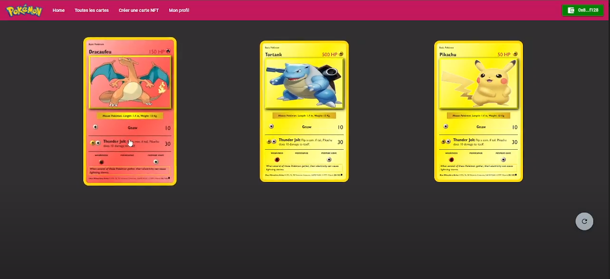

# Pokémon NFT Project

This repository contains the source code for the Pokémon NFT project, allowing you to create your own NFTs using Ethereum and MetaMask.



## Installation and Setup

To get started, follow these steps:

1. Clone this repository:
   ```
   git clone https://github.com/mehdilerari/pokemon-nft
   ```

2. Install the project dependencies:
   ```
   npm install
   ```

3. Launch the project:
   ```
   npm run start
   ```

This will open a web page in your browser.

## Connecting to MetaMask

The next step is to connect to MetaMask. You can use a test account with some Ether preloaded. Import the profile with the following private key:

Private Key: `3ebb695852a022ffe8ca7d2d100891743a9216c6ad0c84570f1ce345db17813b`

Ensure that you switch to the Sepolia network, as we are using it for this project.

## Creating NFTs

That's it! You should now be able to create your own NFTs in this environment. Enjoy your NFT creation journey!
